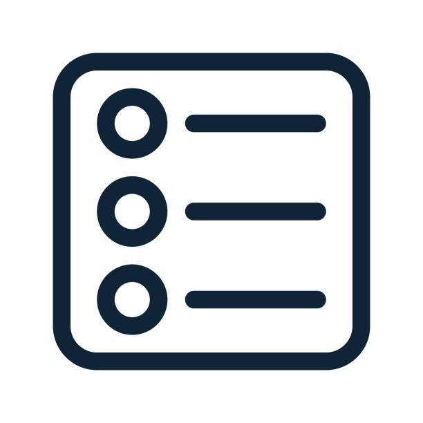
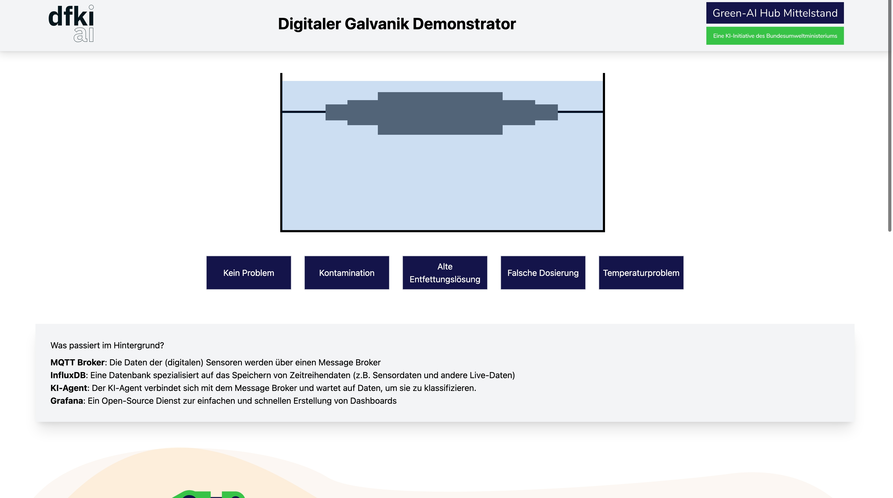
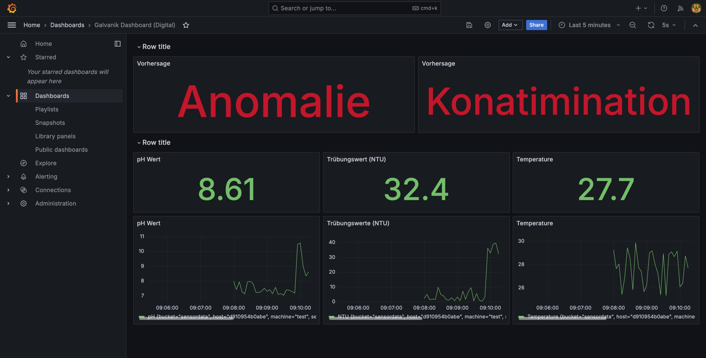

 

  <h1 align="center">Electroplating Demonstrator</h1>
  
  

    <a href="https://github.com/Green-AI-Hub-Mittelstand/electroplating-ai-demonstrator/issues">Report Bug</a>
    ·
    <a href="https://github.com/Green-AI-Hub-Mittelstand/electroplating-ai-demonstrator/issues">Request Feature</a>
  

   

  

    
     
    <h3 align="center"><strong>Green-AI Hub Mittelstand</strong></h3>
    <a href="https://www.green-ai-hub.de"><u>Homepage</u></a> 
    | 
    <a href="https://www.green-ai-hub.de/kontakt"><u>Contact</u></a>
  
   
  

 

## About The Project

This demonstrator is modeled on one of the use cases from the pilot project with 4Packaging. It simulates an electorplating bath and sensors recording pH value, temperature and turbidity. The demonstrator sets up the entire infrastructure to enable the electroplating baths to be monitored. Namely it uses MQTT to transfer data from sensors to InfluxDB, a time series database. At the same time, the data is also transfered to an anomaly agent via MQTT. The agent is based on Python and scikit-learn and implements an Isolation Forest for anomaly detection and a Support Vector Classifier to classify the anomaly regarding error codes. The data as well as the results from the classifiers are displayed in a Grafana dashboard.

(<a href="#readme-top">back to top</a>)

## Table of Contents

  

  <ol>
    <li>
      <a href="#about-the-project">About The Project</a>
    </li>
    <li><a href="#table-of-contents">Table of Contents</a></li>
    <li>
      <a href="#getting-started">Getting Started</a>
      <ul>
        <li><a href="#prerequisites">Prerequisites</a></li>
        <li><a href="#installation">Installation</a></li>
      </ul>
    </li>
    <li><a href="#usage">Usage</a></li>
    <li><a href="#contributing">Contributing</a></li>
    <li><a href="#license">License</a></li>
    <li><a href="#contact">Contact</a></li>
  </ol>

(<a href="#readme-top">back to top</a>)

## Getting Started

Clone this repository, navigate with your terminal into this repository and execute the following steps.

### Prerequisites

The demonstrator requires Docker and Docker Compose to be installed.

### Starting the applications

To start the applications, execute `docker compose up -d`. Docker will automatically build the electroplating bath simulator and the anomaly agent as well as pull any other necessary software from Docker Hub. It will then set up all applications which are then ready to use. If you are interested in customizing the applications' setup please consult the `docker-compose.yaml` file.

The applications will be available as follows (if ports were not change in `docker-compose.yaml`):
- Bath Simulation: http://localhost:5010
- Grafana Dashboard: http://localhost:3000 (initial login: *user*: admin *password*: admin)
- InfluxDB UI: http://localhost:8086 (login: *user*: user *password*: password1234)

(<a href="#readme-top">back to top</a>)

## Usage
### How to use the Demonstrator
This demonstrator provides two main interfaces. One interface simulates an electroplating bath with temperature, pH and turbidity sensors. The user has the opportunity to select certain abnormalities, e.g. the contamination with a foreign agent. In the background the sensor data will be generated according to the selected abnormality (or absence thereof) and sent via MQTT to the InfluxDB and anomaly agent. 

The second interface is the Grafana Dashboard which visualizes the sensor data as well as the predictions from the anomaly agent. Grafana has also the option to send alerts to other services such as MS Teams or Slack enabling a real-time monitoring and warning system.

  

    <!-- First Image -->
    
    
<i>UI for controlling and simulating the electroplating bath</i>

  

  

    <!-- Second Image -->
    
    
<i>Grafana Dashboard</i>

  

(<a href="#readme-top">back to top</a>)

## Contributing

Contributions are what make the open source community such an amazing place to learn, inspire, and create. Any contributions you make are **greatly appreciated**.

If you have a suggestion that would make this better, please fork the repo and create a pull request. You can also simply open an issue with the tag "enhancement".
Don't forget to give the project a star! Thanks again!

1. Fork the Project
2. Create your Feature Branch (`git checkout -b feature/AmazingFeature`)
3. Commit your Changes (`git commit -m 'Add some AmazingFeature'`)
4. Push to the Branch (`git push origin feature/AmazingFeature`)
5. Open a Pull Request

(<a href="#readme-top">back to top</a>)

## License

Distributed under the MIT License. See `LICENSE.txt` for more information.

(<a href="#readme-top">back to top</a>)

## Contact

Green-AI Hub Mittelstand - info@green-ai-hub.de

Project Link: https://github.com/Green-AI-Hub-Mittelstand/electroplating-ai-demonstrator

 
  <a href="https://www.green-ai-hub.de/kontakt"><strong>Get in touch »</strong></a>
 
 

    

(<a href="#readme-top">back to top</a>)
